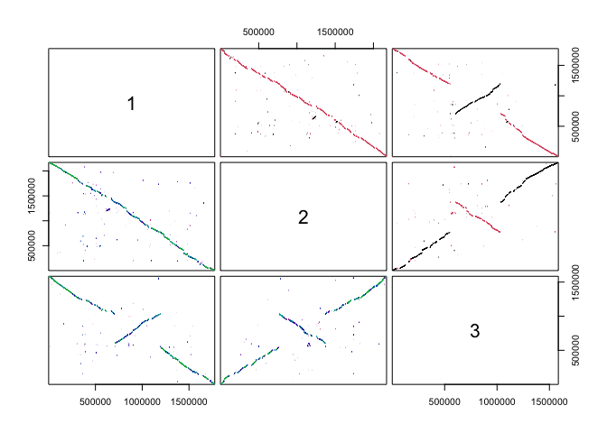

SynExtend 1.25.4
================
Nicholas Cooley
2026-10-02

- [Introduction](#introduction)
- [Installation](#installation)
- [Usage](#usage)

# Introduction

SynExtend was initially a envisioned as a package of tools for working
with Synteny objects produced by the R package `DECIPHER`. It has
expanded past that to include clustering with `Exolabel` and a few other
miscellanious functionalities.

# Installation

SynExtend is homed in Bioconductor and the `release` version can be
installed with the standard Bioconductor boiler plate:

``` r
if (!requireNamespace("BiocManager", quietly = TRUE))
    install.packages("BiocManager")
BiocManager::install()

BiocManager::install("SynExtend")
library("SynExtend")
```

The Bioconductor `devel` version can be installed via:

``` r
if (!requireNamespace("BiocManager", quietly = TRUE))
    install.packages("BiocManager")
BiocManager::install()

BiocManager::install("SynExtend", version = "devel")
library("SynExtend")
```

and the version present in this repository (which should be in line with
Bioc Devel) can be installed via:

``` r
if (requireNamespace("pak", quietly = TRUE)) {
  pak::pkg_install("npcooley/SynExtend")
}
```

# Usage

The primary workflow present in SynExtend is for identifying orthologous
pairs from synteny maps between genomic sequences. The `DECIPHER`
function `FindSynteny` produces high quality synteny maps from sequence
data alone, and SynExtend provides the tools to reconcile that shared
ordered information with feature bounds and infer candidate orthologous
pairs. The workflow is relatively straightforward, and the examples
present here rely on just SynExtend itself, `DECIPHER`, `DBI`, and the
[NCBI edirect utilities](https://www.ncbi.nlm.nih.gov/books/NBK179288/)
for data collection.

``` r
# load our packages, check for esearch
library(SynExtend)
```

    ## Loading required package: DECIPHER

    ## Loading required package: Biostrings

    ## Loading required package: BiocGenerics

    ## Loading required package: generics

    ## 
    ## Attaching package: 'generics'

    ## The following objects are masked from 'package:base':
    ## 
    ##     as.difftime, as.factor, as.ordered, intersect, is.element, setdiff,
    ##     setequal, union

    ## 
    ## Attaching package: 'BiocGenerics'

    ## The following objects are masked from 'package:stats':
    ## 
    ##     IQR, mad, sd, var, xtabs

    ## The following objects are masked from 'package:base':
    ## 
    ##     anyDuplicated, aperm, append, as.data.frame, basename, cbind,
    ##     colnames, dirname, do.call, duplicated, eval, evalq, Filter, Find,
    ##     get, grep, grepl, is.unsorted, lapply, Map, mapply, match, mget,
    ##     order, paste, pmax, pmax.int, pmin, pmin.int, Position, rank,
    ##     rbind, Reduce, rownames, sapply, saveRDS, table, tapply, unique,
    ##     unsplit, which.max, which.min

    ## Loading required package: S4Vectors

    ## Loading required package: stats4

    ## 
    ## Attaching package: 'S4Vectors'

    ## The following object is masked from 'package:utils':
    ## 
    ##     findMatches

    ## The following objects are masked from 'package:base':
    ## 
    ##     expand.grid, I, unname

    ## Loading required package: IRanges

    ## Loading required package: XVector

    ## Loading required package: Seqinfo

    ## 
    ## Attaching package: 'Biostrings'

    ## The following object is masked from 'package:base':
    ## 
    ##     strsplit

    ## 
    ## Attaching package: 'SynExtend'

    ## The following object is masked from 'package:stats':
    ## 
    ##     dendrapply

``` r
library(DBI)

if (nzchar(Sys.which("esearch"))) {
  print(paste("esearch found in the path at:",
              unname(Sys.which("esearch"))))
}
```

    ## [1] "esearch found in the path at: /Users/nicholascooley/edirect/esearch"

Data collection can happen however a user wishes, but requires paired
genomes as fnas and gene calls in gff form. They’re easy to collect from
the NCBI:

``` r
# via esearch
# import into R with a combination of
# interacting tools from:
# DECIPHER
# rtracklayer
# and
# SynExtend

# construct a query
EntrezQuery <- paste("esearch -db assembly ",
                     "-query '",
                     "nitrososphaeria[organism] ",
                     'AND "complete genome"[filter] ', # only complete genomes
                     'AND "refseq has annotation"[properties] ', # only genomes with annotations
                     'AND "latest refseq"[filter] ', # only latest
                     'AND "reference genome"[filter] ', # only reference genomes
                     "NOT anomalous[filter]' ", # no weirdos
                     '| ',
                     'esummary ',
                     '| ',
                     'xtract -pattern DocumentSummary -element FtpPath_RefSeq',
                     sep = "")

# execute the query
FtPPaths <- system(command = EntrezQuery,
                   intern = TRUE,
                   timeout = 300L) # timeout argument is required for RStudio only

# manage the contents of the FTP directory
# we can expect that these files will exist for refseq reference genomes,
# though they may not for genbank records, or non-reference genomes
adds <- mapply(SIMPLIFY = TRUE,
               USE.NAMES = FALSE,
               FUN = function(x, y) {
                 paste0(x,
                        "/",
                        y[10],
                        c("_genomic.fna.gz",
                          "_genomic.gff.gz",
                          "_protein.faa.gz"))
               },
               x = FtPPaths,
               y = strsplit(x = FtPPaths,
                            split = "/",
                            fixed = TRUE))
fnas <- adds[1, , drop = TRUE]
gffs <- adds[2, , drop = TRUE]
amns <- adds[3, , drop = TRUE]

tmp01 <- tempfile()
drv <- dbDriver("SQLite")
conn01 <- dbConnect(drv = drv,
                    tmp01)

# DECIPHER uses databases to manage sequence data
# we drop the sequences into a database, but store our genecalls in a named list
# SquaregffBy does what it says on the label, taking a GRanges object and
# squaring it into a representation that is easier for us to scroll through later
genecalls <- vector(mode = "list",
                    length = length(fnas))
tmp_con <- file(nullfile(), open = "wt")
pBar <- txtProgressBar(style = 1)
PBAR <- length(fnas)
for (m1 in seq_along(gffs)) {
  Seqs2DB(seqs = fnas[m1],
          dbFile = conn01,
          type = "FASTA",
          identifier = as.character(m1),
          verbose = FALSE)
  # import sends things directly to stderr that are difficult to suppress
  # we can sink those messages and discard them ...
  sink(file = tmp_con,
       type = "message")
  tmp_obj <- rtracklayer::import(con = gffs[m1])
  sink(type = "message")
  genecalls[[m1]] <- SquaregffBy(gff_object = tmp_obj,
                                 verbose = FALSE)
  
  setTxtProgressBar(pb = pBar,
                    value = m1 / PBAR)
}
```

    ## ================================================================================

``` r
# close our temp connections
close(tmp_con)
close(pBar)
```

``` r
# genecalls needs names that match the names we gave to our sequences when
# we imported them into the database
names(genecalls) <- seq(length(genecalls))
```

`FindSynteny` can be called directly on a database to create synteny
maps for the all-vs-all comparison for all of the identifiers added to
it. It also accepts an `identifier` argument that can be used to subset
the database contents if desired. Synteny objects are a matrix of
`list`s with the upper and lower triangles filled with related but
slightly different pieces of information.

``` r
syn <- FindSynteny(dbFile = conn01,
                   verbose = TRUE)

# we can plot our maps
pairs(syn[1:3, 1:3])
```

<!-- -->

``` r
# print them
syn[1:3, 1:3]

# and look at the contents
head(syn[[1, 2]])
head(syn[[2, 1]])
```

    ## ================================================================================
    ## 
    ## Time difference of 203.64 secs
    ## 
    ##            1          2        3
    ## 1      1 seq   72% hits 66% hits
    ## 2 278 blocks      1 seq 58% hits
    ## 3 235 blocks 264 blocks    1 seq
    ##      index1 index2 strand width start1  start2 frame1 frame2
    ## [1,]      1      1      0     3 568112 1516263      2      3
    ## [2,]      1      1      0   114 568115 1516266      0      0
    ## [3,]      1      1      0   179 568398 1516549      3      1
    ## [4,]      1      1      0    12 568583 1516734      0      0
    ## [5,]      1      1      0    74 568625 1516776      2      3
    ## [6,]      1      1      0    16 568699 1516850      3      1
    ##      index1 index2 strand score start1  start2   end1    end2 first_hit
    ## [1,]      1      1      0  9366 568112 1516263 579186 1527347         1
    ## [2,]      1      1      0  3835 386745  403384 391759  408398        43
    ## [3,]      1      1      0  2976 365439  687102 369189  690868        47
    ## [4,]      1      1      0  2949 620126 1204224 626302 1210451        57
    ## [5,]      1      1      0  2410 549514  492722 553393  496633        75
    ## [6,]      1      1      0  2400 649894 1234601 654898 1239567       103
    ##      last_hit
    ## [1,]       42
    ## [2,]       46
    ## [3,]       56
    ## [4,]       74
    ## [5,]      102
    ## [6,]      119

`NucleotideOverlap` ingests the Synteny object and the genecalls
associated with the captured genomes, and identifiers where syntenic
hits between two genomes link features. `SummarizePairs` tries to turn
that information into a useful table of attributes candidate orthologous
pairs. `EvaluatePairs` attempts to reject candidate pairs that appear
unlikely to be true orthologous pairs. It’s also good practice to close
our database connection.

``` r
l01 <- NucleotideOverlap(SyntenyObject = syn,
                         GeneCalls = genecalls,
                         Verbose = TRUE)
```

    ## 
    ## Reconciling genecalls.
    ## ================================================================================
    ## Finding connected features.
    ## ================================================================================
    ## Time difference of 7.260489 secs

``` r
p01 <- SummarizePairs(SynExtendObject = l01,
                      DataBase01 = conn01,
                      Verbose = TRUE,
                      Processors = NULL)
```

    ## Collecting pairs.
    ## ================================================================================
    ## Time difference of 59.91855 secs

``` r
p02 <- EvaluatePairs(InputPairs = p01,
                     DataBase01 = conn01,
                     Verbose = TRUE)
```

    ## 
    ## Generating decoy alignments.
    ## 
    ## Completed!
    ## Time difference of 1.709277 mins

``` r
# close our connection
dbDisconnect(conn01)
```

[Exolabel](https://ahl27.com/posts/2025/04/exolabel-full/) is a
clustering routine that performs out of memory fast label propogation.
It is performant and implemented largely in C. Alternatively users could
substitute with [MCL](https://micans.org/mcl/) if they’re more familiar
with it. It is currently in the submission process for publication.

``` r
tmp_pairs <- tempfile()

write.table(x = p02[, c(1, 2, 13)],
            sep = "\t",
            quote = FALSE,
            append = FALSE,
            col.names = FALSE,
            row.names = FALSE,
            file = tmp_pairs)

res <- ExoLabel(edgelistfiles = tmp_pairs,
                return_table = TRUE)

clusts <- res$results

clusts <- tapply(X = clusts$Vertex,
                 INDEX = clusts$Cluster,
                 FUN = c)
# index names are meaningless here
names(clusts) <- NULL
unlink(tmp_pairs)

# clusters *must* be single copy
single_copy <- vapply(X = clusts,
                      FUN = function(x) {
                        y <- strsplit(x = x,
                                      split = "_",
                                      fixed = TRUE)
                        y <- do.call(rbind,
                                     y)
                        nrow(y) == length(unique(y[, 1, drop = TRUE]))
                      },
                      FUN.VALUE = vector(mode = "logical",
                                         length = 1))
sc_clusts <- clusts[single_copy]
```

An adhoc plotting routine is included in example code
[here](https://npcooley.github.io/projects/using_synextend.html) that
relies on `gggenomes` for plotting; internal functions for plotting
without external dependencies are coming soon(ish). `FindColocalSets`
identifies where co-occuring clusters are co-localized within nucleotide
distance set by the `max_gap` parameter.

``` r
colocals <- FindColocalSets(genecalls = genecalls,
                            detected_sets = sc_clusts,
                            max_gap = 5000)
```
